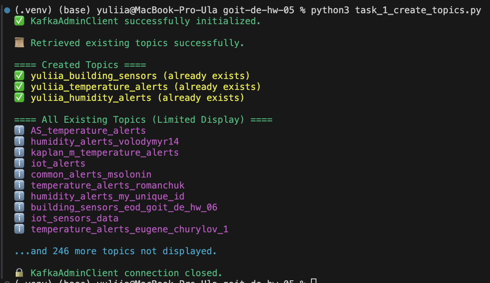
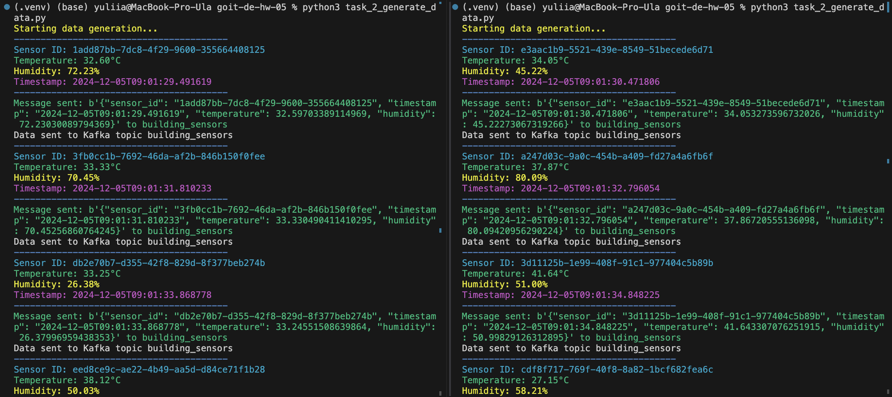
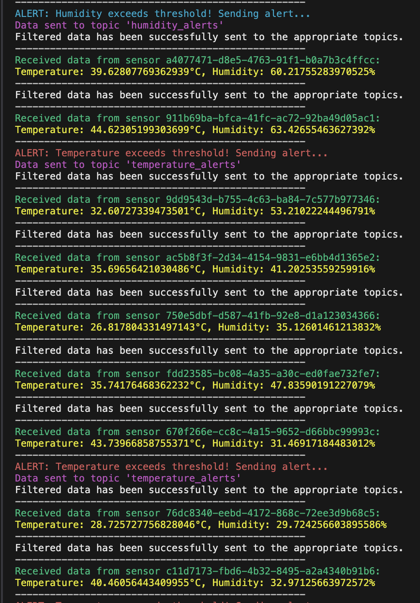
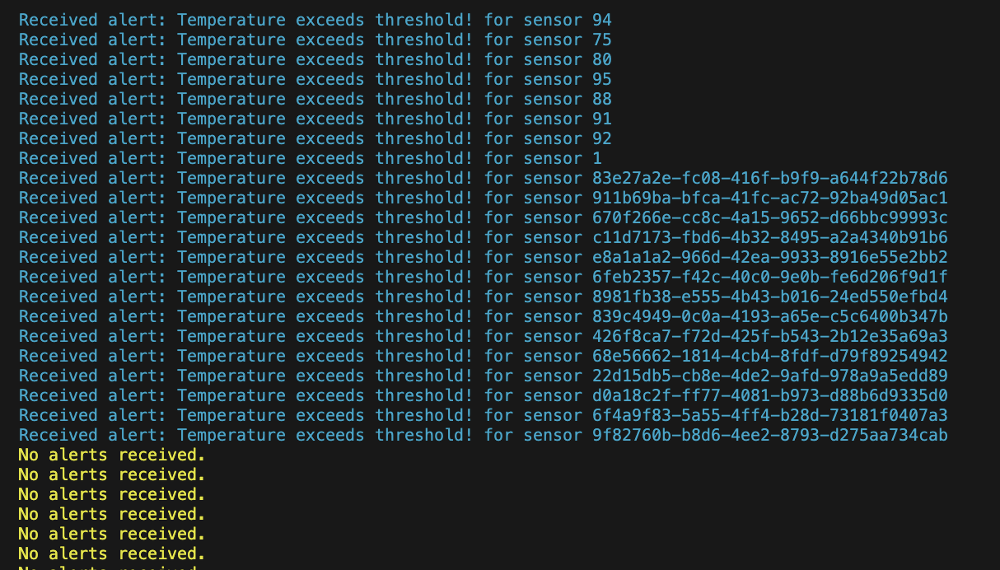
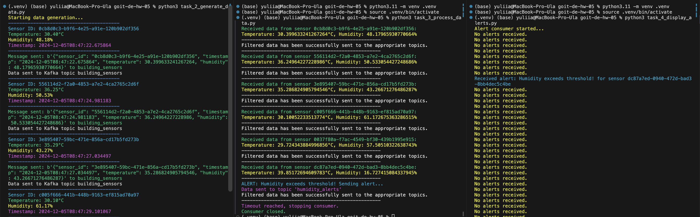

# Домашнє завдання до теми «Apache Kafka»

Ну що, налаштувалися на виконання домашнього завдання? Тодi полетiли! 🎢

Сьогодні ви зосередитесь на практичному застосуванні Apache Kafka за допомогою
Python API, відпрацюванні вміння створювати топіки, записувати дані у топік та
читати їх.

Уявіть, що ви працюєте в компанії, яка займається розробкою систем моніторингу
для Інтернету Речей (IoT). Основне завдання системи — збирати дані з різних
датчиків, що встановлені в декількох різних будівлях, і аналізувати ці дані в
реальному часі для відстеження таких показників, як температура та вологість.

Для цього використовується Apache Kafka як платформа обміну повідомленнями, що
дозволяє ефективно передавати та обробляти великі обсяги даних.

Ваше завдання — реалізувати декілька компонентів цієї системи, використовуючи
Python та Apache Kafka, у відповідності з інструкцією.

Нехай це домашнє завдання розширить вашу перспективу у світі потокових даних! 🧠

## Покрокова інструкція виконання

### 1. Створення топіків в Kafka:

- Створіть три топіки в Kafka:

> [!NOTE]
>
> До імен топіків добавте свої імена або інші ідентифікатори, щоб імена топіків
> не дублювалися.

- `building_sensors` — для зберігання даних з усіх датчиків,
- `temperature_alerts` — для зберігання сповіщень про перевищення допустимого
  рівня температури,
- `humidity_alerts` — для зберігання сповіщень про вихід рівня вологості за
  допустимі рамки.

### 2. Відправка даних до топіків:

- Напишіть Python-скрипт, який імітує роботу датчика і періодично відправляє
  випадково згенеровані дані (температура та вологість) у топік
  `building_sensors`.
- Дані мають містити ідентифікатор датчика, час отримання даних та відповідні
  показники.
- Один запуск скрипту має відповідати тільки одному датчику. Тобто, для того,
  щоб імітувати декілька датчиків, необхідно запустити скрипт декілька разів
  > [!NOTE]
  >
  > ID датчика може просто бути випадковим числом, але постійним (однаковим) для
  > одного запуску скрипту. При повторному запуску ID датчика може змінюватись.
- Температура — це випадкова величина від 25 до 45.
- Вологість — це випадкова величина від 15 до 85.

### 3. Обробка даних:

- Напишіть Python-скрипт, який підписується на топік `building_sensors`, зчитує
  повідомлення і перевіряє отримані дані:

- - якщо температура перевищує 40°C, генерує сповіщення і відправляє його в
    топік `temperature_alerts`;

- - якщо вологість перевищує 80% або сягає менше 20%, генерує сповіщення і
    відправляє його в топік `humidity_alerts`.

- Сповіщення повинні містити ідентифікатор датчика, значення показників, час та
  повідомлення про перевищення порогового значення.

### 4. Остаточні дані:

- Напишіть Python-скрипт, який підписується на топіки `temperature_alerts` та
  `humidity_alerts`, зчитує сповіщення виводить на екран повідомлення.

## Критерії прийняття та оцінювання ДЗ

> [!WARNING]
>
> ☝🏻 Критерії прийняття домашнього завдання є обов’язковою умовою оцінювання
> домашнього завдання ментором. Якщо якийсь з критеріїв не виконано, ДЗ
> відправляється ментором на доопрацювання без оцінювання. Якщо вам «тільки
> уточнити»😉 або ви «застопорилися» на якомусь з етапів виконання — звертайтеся
> до ментора у Slack).

1. Створення 3 топіків (10 балів).

2. Генерація даних сенсорів та відправка даних в `building_sensors` (20 балів).

3. Отримання даних з `building_sensors`, фільтрація даних (25 балів).

4. Відправка фільтрованих даних в `temperature_alerts` та `humidity_alerts` (30
   балів).

Завдання є продовженням попереднього.

5. Отримання даних з temperature_alerts і humidity_alerts та виведення на екран
   (15 балів).

#### Загальна максимальна кількість балів — 100.

> [!NOTE]
>
> Якщо є помилки або недоліки виконання, кількість балів на кожному етапі
> зменшується пропорційно до наявних помилок на розсуд ментора.

> [!CAUTION]
>
> 💡 УВАГА!!
>
> У вас є можливість обрати підхід до виконання та можливого доопрацювання
> домашнього завдання:
>
> 1. задовольнитися першою отриманою оцінкою (звісно ж, якщо вона вище
>    прохідного бала),
> 2. намагатися отримати вищий бал шляхом можливого послідуючого доопрацювання
>    роботи у відповідності з фідбеком ментора.
>
> Обраний підхід до виконання ДЗ необхідно зазначити у полі для здачі до
> прикріпленого завдання. За відсутності коментаря ментор дотримується першого
> підходу й виставляє отриману оцінку.

> [!NOTE]
>
> 💡 Відправляйте ДЗ на перевірку, коли зроблено все можливе, оскільки кількість
> спроб здачі завдання впливає на отриманий бал! За кожну наступну спробу після
> другої (тобто з третьої) максимально можлива кількість балів зменшується на 5.
>
> Критерії оцінювання робіт у магістратурі GoIt Neoversity

### Підготовка та завантаження домашнього завдання

1. Створіть публічний репозиторій `goit-de-hw-05`.

2. Виконайте завдання та відправте у свій репозиторій код та скриншоти виконання
   для кожного з етапів у текстовому документі з коротким описом виконання
   завдання.

#### Перелік необхідних скриншотів:

- скрин трьох топіків з команди
  `[print(topic) for topic in admin_client.list_topics() if "my_name" in topic]`
  ;
- скрин генерації даних сенсорів та відправки даних в `building*sensors` з
  демонстрацією двох (або більше) одночасних роботи двох запусків програми;
- скрин отримання даних та фільтрації саме тих даних, що будуть далі
  використані;
- скрин з демонстрацією того, що відфільтровані дані були послані у відповідні
  топіки;
- скрин з результатом запису відфільтрованих даних.

3. Створіть один архів, що містить весь код виконання завдання, та текстовий
   документ із скриншотами, прикріпіть його в LMS. Назва архіву повинна бути у
   форматі ДЗ5\*ПІБ.

4. Прикріпіть посилання на репозиторій `goit-de-hw-05` та відправте на
   перевірку.

## Формат здачі

- Посилання на репозиторій `goit-de-hw-05`.
- Прикріплений архів із назвою ДЗ5_ПІБ.

### Результат виконаного завдання № 1

### Результат виконаного завдання № 2

### Результат виконаного завдання № 3

### Результат виконаного завдання № 4

### Результат одночасного виконаного декількох завдань

